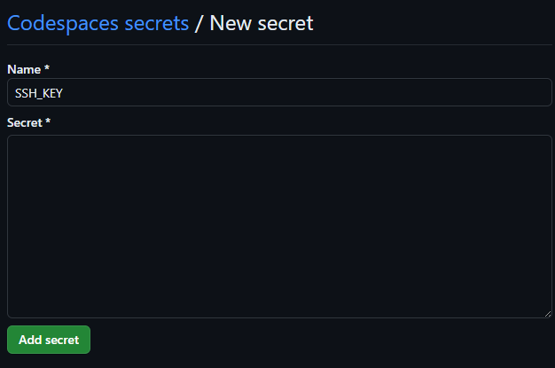

# README
This is a template repository to allow creating repos with GitHub actions enabled to install an AWS .pem key from the Learner Lab into GitHub Codespaces. This will allow students to ssh to their AWS resources from the Codespace terminal. To use this template, you need to:

1. Create a repo using this as a template.
2. Add your .pem file as a GitHub secret called "SSH_KEY" using the following steps in **YOUR** new repository:
    - Go to **Settings** (top right corner)
    - Click on **Secrets and variables**
    - Click on **Codespaces**
    - Click the Green button labelled **New repository secret**
3. Add the secret:
    - With the name **SSH_KEY**
    - In the **Secret * ** field, paste in the contents of your .pem file (cat from your local command line and copy/paste)
    - Your screen should look as follows (note, in the screenshot the secret field has been left empty)
    
    - Click the green button labelled **Add secret**